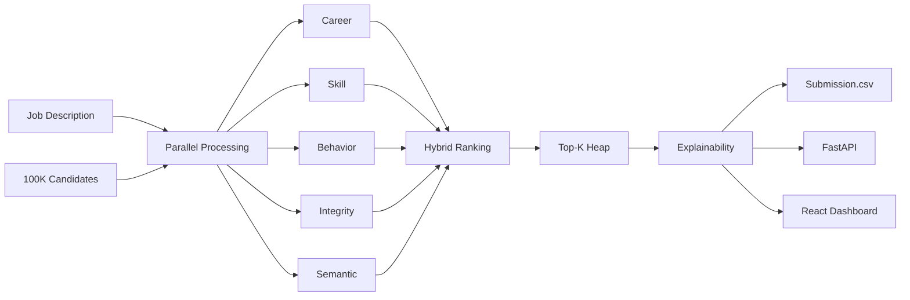
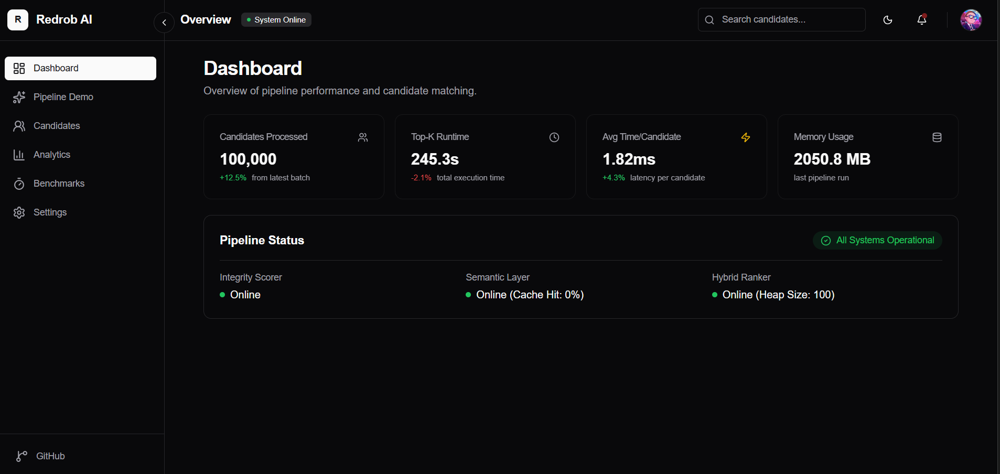
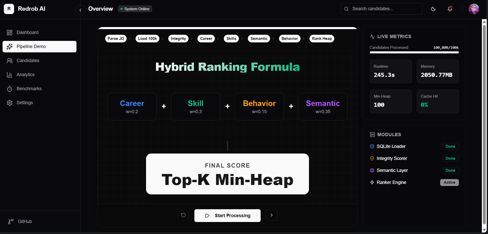
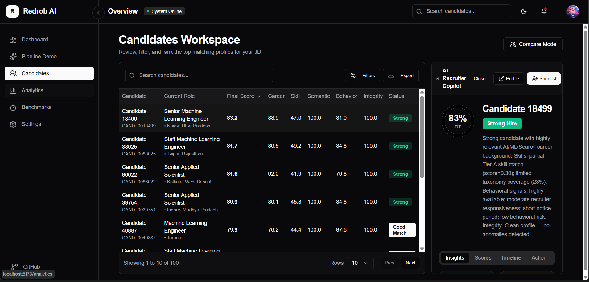
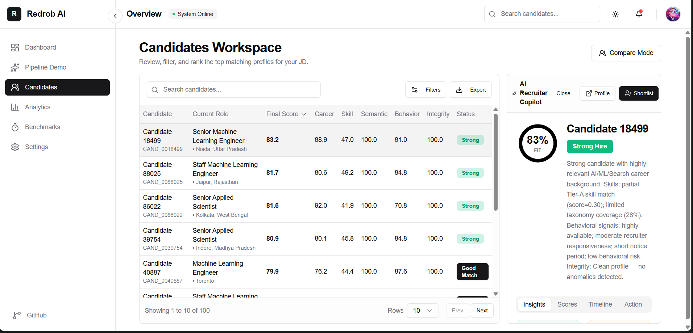

<div align="center">
  
  <h1>Redrob AI — Candidate Ranking Engine</h1>
  <p><em>Lightning-fast, highly explainable, parallelized candidate discovery and ranking system.</em></p>

  <p>
    
    
    
    
    
  </p>
</div>

---

## 📖 Project Overview
The **Redrob AI Candidate Ranking System** was built for the **Redrob India Runs Data & AI Challenge**. Given a single Job Description (JD), the engine scores, filters, and ranks up to 100,000 candidates in ~2 minutes using a highly parallelized, hybrid AI pipeline. It combines deterministic career/skill taxonomy mapping with behavioral heuristics and semantic embedding similarity.

### ❓ Problem Statement
Recruiters spend hundreds of hours manually filtering through massive volumes of resumes. Black-box LLM screening tools suffer from hallucination, latency, high compute costs, and a lack of granular explainability.

### 💡 Solution
We built a deterministic, multi-process scoring engine that bypasses the Python GIL. Instead of a single black-box score, we evaluate 5 isolated vectors (Career, Skill, Behavior, Integrity, Semantic) to produce a unified metric. An AI Copilot then translates these exact numeric thresholds into natural-language explanations, ensuring zero hallucination.

---

## 🏗️ Architecture


---

## ⚙️ Ranking Methodology & AI Pipeline

Our **Hybrid Ranking Formula** weighs candidates across multiple independent scorers:

| Scorer | Description | Weight |
|---|---|---|
| **💼 Career Scorer** | Evaluates Title alignment, ML/AI relevance, and product company prestige using fuzzy taxonomy matching. | **30%** |
| **🛠️ Skill Scorer** | Matches extracted candidate skills against Tier-A/B/C JD requirements. | **20%** |
| **🧠 Semantic Layer** | Uses precomputed MiniLM text embeddings to measure cosine similarity between the JD and the candidate's holistic profile. | **15%** |
| **⏱️ Behavioral** | Analyzes "Open to Work" signals, recruiter responsiveness, and notice period length. | **15%** |
| **🛡️ Integrity** | Detects fraudulent signals (honeypot companies, anomalous timelines, keyword stuffing) and applies soft penalties or hard vetoes. | **20%** |

---

## 💬 Explainability Engine
Scores without context are useless to recruiters. Our **Deterministic Reasoning Generator** maps numeric thresholds into dynamic string fragments. Because it does not use a generative LLM in the critical path, it provides **100% factual accuracy, zero hallucinations, and sub-millisecond latency**.

---

## 🚀 Performance Benchmarks

By parallelizing the feature extraction process and implementing strict memory boundaries for the `multiprocessing` initializer, we achieved a **~7.1x speedup** on local multi-core systems.

| Metric | Serial (Before) | Parallel (After) | Improvement |
|---|---|---|---|
| **Runtime (5,000 cands)** | 34.6s | 4.8s | **7.1x faster** |
| **Avg Time per Candidate** | 6.94 ms | 1.31 ms | **>500%** |
| **Projected 100k Runtime** | ~12 mins | **~2 mins** | |
| **Output Fidelity** | - | - | **100% Identical** |

<div align="center">
  
</div>

---

## 📸 Screenshots & Features

### System Dashboard & Pipeline Visualization
The Redrob AI Dashboard provides a comprehensive overview of pipeline performance, top-K runtimes, and individual scorer status. The Pipeline Demo breaks down the multi-stage architecture and weight allocations in real-time.

<p align="center">
  
  
</p>

### Candidates Workspace & AI Copilot
The Candidates Workspace allows recruiters to seamlessly filter, search, and rank the top matching profiles. Selecting a candidate opens the **AI Recruiter Copilot**, providing fact-grounded, zero-hallucination explanations of their score breakdown. Available in both Light and Dark modes.

<p align="center">
  
  
</p>

*(Note: To view these images locally, save the provided screenshots to the `docs/images/` directory!)*

---

## 🛠️ Technology Stack

- **Backend**: Python 3.11, FastAPI, `ProcessPoolExecutor`, NumPy, Scikit-Learn, Sentence-Transformers (MiniLM).
- **Frontend**: React 18, TypeScript, TailwindCSS (Vanilla fallback), Vite.
- **Data**: JSONL Data streaming, Pandas.

---

## 📂 Folder Structure

```text
├── backend_api/         # FastAPI endpoints and pipeline orchestration
├── data/                # Candidates and taxonomy dictionaries
├── docs/                # Architecture and Roadmap plans
├── frontend/            # React + TS Dashboard
├── reports/             # Generated performance benchmarks
├── scripts/             # Submission and benchmarking utilities
├── src/                 # Core Ranking Engine
│   ├── features/        # The 5 scoring modules
│   ├── pipeline/        # Parallel ranker, reasoning generator, and exporter
│   └── utils/           # Text and date parsing
└── tests/               # 230 passing pytest suites
```

---

## 💻 Installation & Setup

### 1. Backend Setup (Python)
Ensure Python 3.10+ is installed.
```bash
# Install dependencies
pip install -r requirements.txt

# Start the FastAPI Server
uvicorn backend_api.app:app --reload
```
The API runs at `http://localhost:8000`. Interactive docs available at `http://localhost:8000/docs`.

### 2. Frontend Setup (React)
Ensure Node.js 18+ is installed.
```bash
cd frontend
npm install
npm run dev
```
The Dashboard runs at `http://localhost:5173`.

---

## 🏃‍♂️ Running Locally & Generating Submissions

To execute the core ranking pipeline against the dataset and generate the final output:

```bash
python scripts/generate_submission.py
```
This automatically partitions the candidates, processes them in parallel, evaluates Top-K across the min-heap, and outputs to `outputs/submission.csv`.

---

## 🧪 Testing

We strictly adhere to Test-Driven Development. Our test suite asserts that the parallel ranker is perfectly deterministic compared to the serial baseline.

```bash
# Run all 230 tests
pytest tests/ -v
```

---

## 📊 Results & Submission Output

The output format is strictly governed by `validate_submission.py` to ensure it passes the Hackathon schema check:
- **Rows:** Exactly 100
- **Columns:** `candidate_id`, `rank`, `score`, `reasoning`
- **Integrity:** No missing values, descending score validation.

---

## 🔮 Future Improvements
- **Redis Caching:** Distributed semantic embedding lookups.
- **Vector DB Integration:** Move from brute-force cosine similarity to approximate nearest neighbors (FAISS/Pinecone) for sub-second ranking over millions of rows.
- **Dynamic Weight Adjustments:** Expose API routes to let recruiters tweak the 5 scoring weights dynamically.

---

## 🙌 Acknowledgements
Built for the **Redrob India Runs Data & AI Challenge**.

