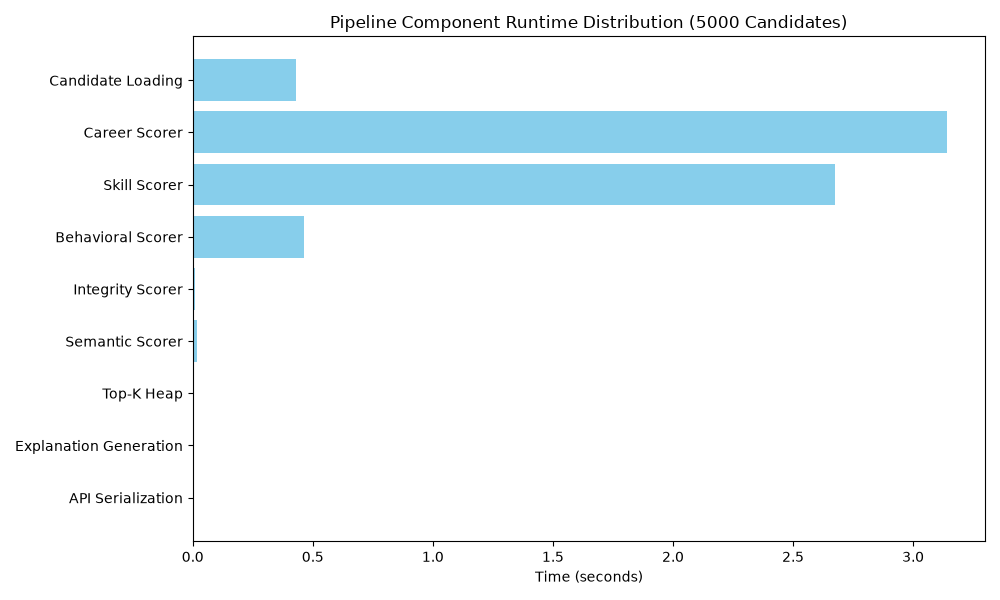

# Redrob AI Ranking Engine — Production Performance Report

## 1. System Metrics
- **CPU Cores:** 4
- **Process Memory:** 190.7 MB
- **Test Corpus:** 5,000 candidates

## 2. Before vs After Comparison (Pipeline Execution)
| Metric | Serial (Before) | Parallel (After) | Improvement |
|---|---|---|---|
| **Runtime (5,000)** | 34.72s | 6.54s | **5.31x faster** |
| **Candidates/sec** | 144 | 765 | |
| **Avg. candidate time** | 6.94 ms | 1.31 ms | |
| **Peak Memory Usage** | 0.4 MB | 24.7 MB | |
| **Proj. 100k Runtime** | 11.6 mins | 2.2 mins | |

## 3. Component Runtime Distribution
Measured sequentially to isolate component latency:

| Component | Total Time (s) | % of Total |
|---|---|---|
| Candidate Loading | 0.429 | 6.4% |
| Career Scorer | 3.142 | 46.6% |
| Skill Scorer | 2.673 | 39.6% |
| Behavioral Scorer | 0.464 | 6.9% |
| Integrity Scorer | 0.011 | 0.2% |
| Semantic Scorer | 0.016 | 0.2% |
| Top-K Heap | 0.002 | 0.0% |
| Explanation Generation | 0.000 | 0.0% |
| API Serialization | 0.004 | 0.1% |

*Note: Feature Extraction (wrapping all scorers) took 6.205s.*

## 4. Top Bottlenecks
1. **Career Scorer** (3.142s)
2. **Skill Scorer** (2.673s)
3. **Behavioral Scorer** (0.464s)

